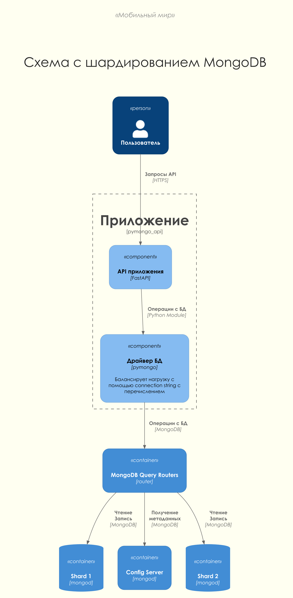
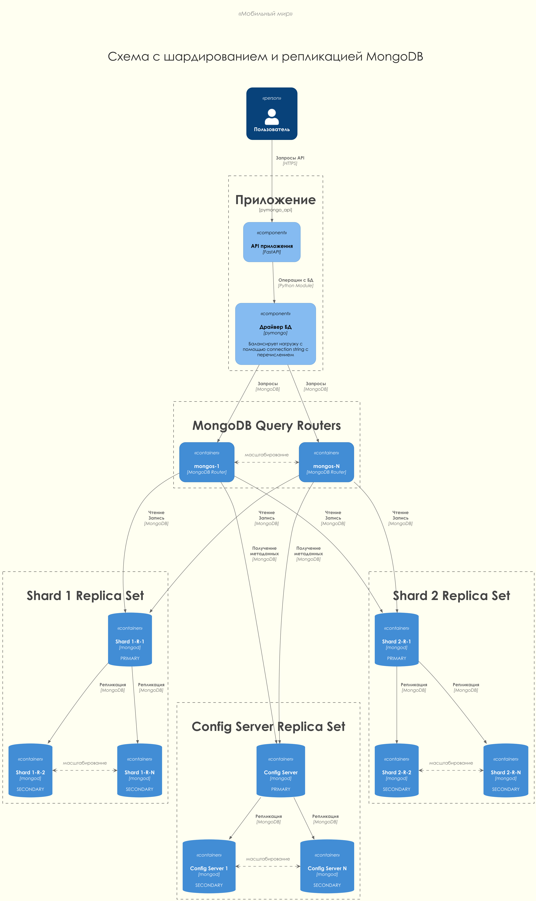
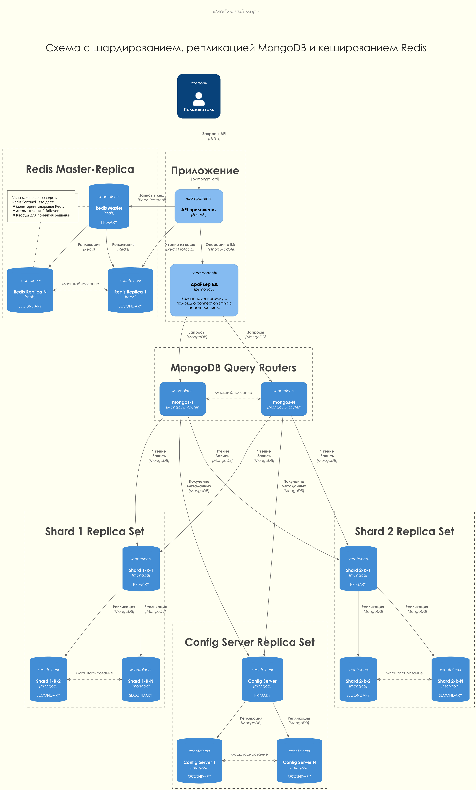
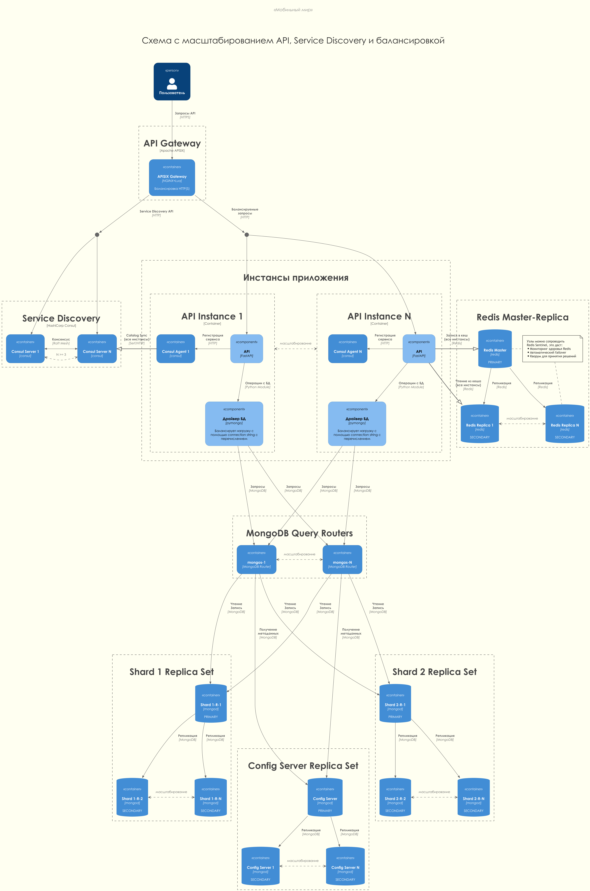
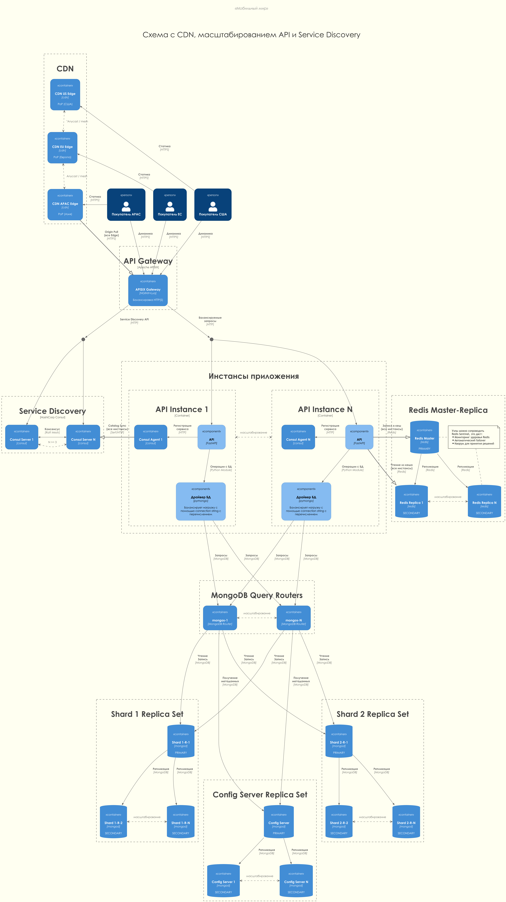

# pymongo-api

## Как запустить

Запускаем mongodb и приложение

```shell
docker compose up -d
```

Заполняем mongodb данными

```shell
./scripts/mongo-init.sh
```

## Как проверить

Состояние стека должно быть видно с помощью
```shell
docker compose ps
```

### Вручную

#### Если вы запускаете проект на локальной машине

Откройте в браузере http://localhost:8080

#### Если вы запускаете проект на предоставленной виртуальной машине

Узнать белый ip виртуальной машины

```shell
curl --silent http://ifconfig.me
```

Откройте в браузере http://<ip виртуальной машины>:8080

### Автоматическое тестирование

Для проверки корректности работы приложения написаны интеграционные тесты.

Запустить тесты (запустит стек приложения тоже):
```shell
docker compose --profile test run api_test
```

Результаты тестов будут выведены в консоль.

### Проверка корректности кода

Для проверки качества кода используется [Ruff](https://docs.astral.sh/ruff/):

Проверка с выводом ошибок в консоль:
```shell
docker compose --profile lint run --rm ruff
```

С автоматическим исправлением ошибок:
```shell
docker compose --profile lint run --rm ruff --fix
```

Также можно использовать любые другие параметры ruff, например `--show-files`, `--statistics`, `--show-fixes` и т.д.

## Доступные эндпоинты

Список доступных эндпоинтов, swagger http://<ip виртуальной машины>:8080/docs

## Шардирование, репликация и кеширование

Выполнено в виде отдельных директорий - подробнее ниже.

Проверить каждую можно с помощью `cd название-решения` и затем

```shell
docker compose down -v && docker compose up -d && ./mongo-init.sh && docker compose --profile test run --build pymongo_api_test && docker compose down -v
```

# Ревью заданий

Задания документированы в [doc/task/readme.md](doc/task/readme.md).

Для повышения удобства ревью основное приложение и решения заданий 2, 3, 4 покрыты тестами.
Тесты находятся в директории `api_app_test` каждой копии приложения.
Запуск тестов описан в инструкции по запуску к каждому приложению.

## Задание 1. Планирование

Разработаны пять последовательных вариантов архитектурных схем, отражающих эволюцию решения от изначального стенда до финальной инфраструктуры с Service Discovery, балансировкой и CDN:

- [planning_1_sharding.png](doc/c4/deployment/planning_1_sharding.png) - схема шардирования MongoDB.
- [planning_2_replication.png](doc/c4/deployment/planning_2_replication.png) - добавлена репликация шардов.
- [planning_3_caching.png](doc/c4/deployment/planning_3_caching.png) - подключён Redis для кеширования.
- [planning_4_service-discovery-balancing.png](doc/c4/deployment/planning_4_service-discovery-balancing.png) - добавлены Consul и API Gateway.
- [planning_5_service-discovery-balancing-cdn.png](doc/c4/deployment/planning_5_service-discovery-balancing-cdn.png) - CDN для статического контента.

## Задание 2. Шардирование

Создан проект [mongo_sharding](mongo_sharding/), реализующий кластер MongoDB с двумя шардами:

- [adr.md](mongo_sharding/adr.md) - выбор метода шардирования
- [README.md](mongo_sharding/README.md) - инструкции по запуску
- [compose.yaml](mongo_sharding/compose.yaml) - стек контейнеров
- [mongo-init.sh](mongo_sharding/mongo-init.sh) - инициализация кластера
- [api_app_test](mongo_sharding/api_app_test/app_test.py) - тесты, подтверждающие выполнение задания



## Задание 3. Репликация

Проект [mongo_sharding_repl](mongo_sharding_repl/) расширяет шардирование репликацией каждого компонента:

- [README.md](mongo_sharding_repl/README.md) - инструкции по запуску
- [compose.yaml](mongo_sharding_repl/compose.yaml) - стек контейнеров
- [mongo-init.sh](mongo_sharding_repl/mongo-init.sh) - инициализация кластера
- [api_app_test](mongo_sharding_repl/api_app_test/app_test.py) - тесты, подтверждающие выполнение задания



## Задание 4. Кеширование

Проект [sharding_repl_cache](sharding_repl_cache/) добавляет Redis для кеширования ответов:

- [adr.md](sharding_repl_cache/adr.md) - выбор метода кеширования
- [README.md](sharding_repl_cache/README.md) - инструкции по запуску
- [compose.yaml](sharding_repl_cache/compose.yaml) - стек контейнеров
- [mongo-init.sh](sharding_repl_cache/mongo-init.sh) - инициализация кластера
- [api_app_test](sharding_repl_cache/api_app_test/app_test.py) - тесты, подтверждающие выполнение задания



## Задание 5. Service Discovery и балансировка

На основе кеширующего решения добавлены Consul и API Gateway (APISIX) с несколькими инстансами приложения.



## Задание 6. CDN

 [Финальный вариант схемы](doc/c4/deployment/planning_5_service-discovery-balancing-cdn.png) демонстрирует подключение CDN для пользователей из разных регионов. CDN кэширует статический контент и взаимодействует с API Gateway.



